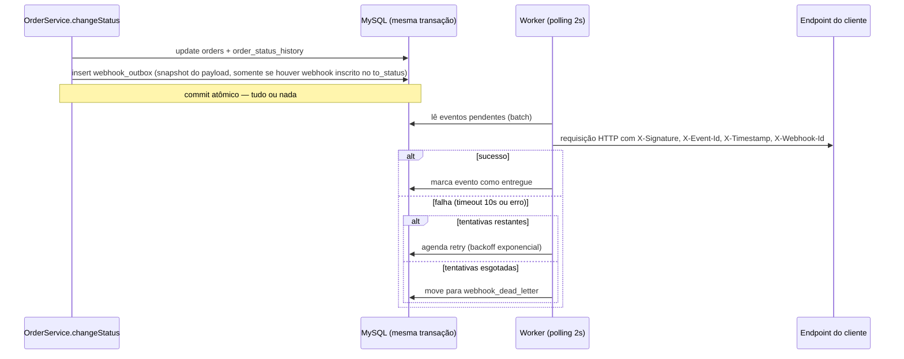

# RFC: Sistema de Webhooks de Notificação de Pedidos

## Metadados

- **Autor:** Larissa (Tech Lead) — conduziu a reunião técnica que originou esta proposta e se comprometeu a formalizá-la em documento de design ([09:50] Larissa: "Eu vou abrir o doc de design da feature e marcar uma sessão pro Bruno e o Diego revisarem comigo antes da gente começar a codar").
- **Status:** Em revisão
- **Data:** 2026-09-24 (documento produzido a partir da reunião técnica registrada em `TRANSCRICAO.md`, realizada numa quinta-feira às 09:00)
- **Revisores:** todos os participantes da reunião técnica que originou esta proposta — Bruno (Engenheiro Pleno, time de Pedidos) e Diego (Engenheiro Sênior, time de Plataforma), convocados por Larissa para revisar o design antes do início da codificação ([09:50] Larissa); Sofia (Engenheira de Segurança), com revisão de código dedicada a HMAC e geração de secret antes do deploy ([09:46] Sofia); Marcos (Product Manager), como stakeholder de produto.

## Resumo Executivo (TL;DR)

Três clientes B2B (Atlas Comercial, MaxDistribuição, Nova Cargo) precisam ser notificados abaixo de 10 segundos quando o status de um pedido muda, em vez de fazerem polling em `GET /orders` ([09:00]-[09:02] Marcos). Propomos um sistema de **webhooks outbound** (o OMS envia, não recebe) baseado no padrão **Transactional Outbox** sobre o MySQL já existente: a mudança de status grava um evento na mesma transação que atualiza o pedido, e um **worker separado em polling de 2 segundos** processa essa outbox, entregando eventos com **retry exponencial**, **Dead Letter Queue** para falhas persistentes, **autenticação HMAC-SHA256** por endpoint e **garantia at-least-once** com deduplicação via `X-Event-Id`. A feature é estimada em três sprints, incluindo revisão de segurança ([09:45]-[09:47] Larissa/Sofia).

## Contexto e Problema

Hoje, clientes integrados ao OMS descobrem mudanças de status de pedido fazendo polling periódico em `GET /orders`, o que segundo Marcos "tá deixando a integração lenta e cara pra eles" ([09:00] Marcos). A Atlas Comercial "chegou a sugerir" migrar para um concorrente caso a entrega não saia até o fim do trimestre ([09:00] Marcos). O requisito de latência foi definido como "abaixo de 10 segundos" ([09:02] Marcos).

O sistema atual não possui nenhum mecanismo de eventos, filas ou notificação externa (não há dependências de mensageria em `package.json`, nem módulo correspondente em `src/`) — a mudança de status de pedido é hoje uma operação transacional isolada em `OrderService.changeStatus()` ([src/modules/orders/order.service.ts:126](../src/modules/orders/order.service.ts)), que atualiza `orders`, registra em `order_status_history` e ajusta `stock_quantity` dos produtos. Qualquer solução de notificação precisa se integrar a essa transação sem comprometer sua atomicidade nem sua performance ([09:04] Bruno).

## Proposta Técnica

A proposta combina seis decisões arquiteturais centrais — mais uma decisão complementar sobre o formato do evento, descrita ao final desta seção — cada uma detalhada em um ADR próprio:

1. **Padrão Outbox no MySQL** ([ADR-001](adrs/ADR-001-outbox-pattern-no-mysql.md)): a mudança de status insere um evento em uma tabela `webhook_outbox`, na mesma transação SQL que já atualiza `orders` e `order_status_history` — garantindo que status e evento nunca fiquem inconsistentes entre si.
2. **Worker separado em polling de 2s** ([ADR-002](adrs/ADR-002-worker-processo-separado-em-polling.md)): um processo Node independente (`src/worker.ts`, novo arquivo a ser criado) lê a outbox periodicamente e dispara as chamadas HTTP, isolando a latência de entrega da transação de negócio.
3. **Retry com backoff exponencial e Dead Letter Queue** ([ADR-003](adrs/ADR-003-retry-com-backoff-e-dead-letter-queue.md)): eventos que falham são reentregues com backoff crescente (1m/5m/30m/2h/12h); esgotadas as tentativas, o evento vai para uma tabela `webhook_dead_letter`, reprocessável manualmente por um administrador.
4. **Autenticação HMAC-SHA256 por endpoint** ([ADR-004](adrs/ADR-004-autenticacao-hmac-sha256-por-endpoint.md)): cada endpoint de webhook cadastrado tem sua própria secret, com suporte a rotação e grace period de 24h.
5. **Garantia at-least-once com `X-Event-Id`** ([ADR-005](adrs/ADR-005-garantia-at-least-once-com-x-event-id.md)): o cliente pode receber o mesmo evento mais de uma vez e é responsável por deduplicar usando esse identificador único.
6. **Reuso máximo dos padrões existentes** ([ADR-006](adrs/ADR-006-reuso-dos-padroes-existentes-do-projeto.md)): o módulo `src/modules/webhooks/` (novo, a ser criado) segue a mesma estrutura (controller/service/repository/routes/schemas), reaproveita `AppError`, o logger Pino e o middleware de erro já existentes, sem introduzir novas convenções nem um novo logger ([09:29]-[09:30] Bruno/Larissa).

Complementarmente, o payload de cada evento é montado (snapshot) no momento da inserção na outbox, não recalculado no envio ([ADR-007](adrs/ADR-007-payload-snapshot-na-insercao-do-evento.md)).

Fluxo de alto nível:

Sobre requisitos funcionais (CRUD de configuração de webhook, histórico de entregas, endpoint de replay de DLQ) e o contrato técnico completo dos endpoints, ver o [FDD](FDD.md) — este RFC intencionalmente não repete esse nível de detalhe.

## Alternativas Consideradas

1. **Disparo síncrono do webhook dentro de `OrderService.changeStatus()`.** Descartada por dois motivos levantados por Bruno: um cliente lento travaria mudanças de status de outros pedidos, já que a transação atual "já é pesada" ([09:04] Bruno); e não há como fazer rollback de uma mudança de status já efetivada se o cliente estiver fora do ar ([09:04] Bruno). Diego reforçou: "Síncrono está fora de questão" ([09:06] Diego). **Trade-off:** o síncrono evitaria a complexidade de um worker e de uma tabela nova, mas ao custo de acoplar a disponibilidade de sistemas externos a uma transação de negócio crítica.
2. **Fila dedicada (ex.: Redis Streams) em vez de outbox no MySQL.** Levantada por Larissa e descartada por Diego: "a gente é um time pequeno. Subir Redis Cluster pra isso é overengineering. Outbox no MySQL existente resolve" ([09:07] Diego; decisão fechada por Larissa em [09:08]). **Trade-off:** uma fila dedicada é a solução mais convencional de mercado para esse problema, mas exigiria subir e operar infraestrutura nova ("a gente acabaria precisando subir mais infra", [09:07] Larissa) sem necessidade real, dado que o MySQL já existente resolve.
3. **Garantia exactly-once em vez de at-least-once.** Descartada por exigir coordenação distribuída entre OMS e cliente, uma complexidade considerada desnecessária frente ao padrão adotado por outras plataformas de mercado (Stripe, GitHub) ([09:25] Diego). **Trade-off:** exactly-once eliminaria a necessidade de deduplicação do lado do cliente, mas ao custo de um protocolo de confirmação muito mais complexo dos dois lados.

## Questões em Aberto

1. **Rate limiting de envio ao cliente.** Se um cliente tiver muitos pedidos mudando de status em um curto intervalo, o worker pode enviar um volume alto de chamadas em sequência para o mesmo endpoint. Diego levantou o ponto e o próprio grupo decidiu não resolver agora, mas deixá-lo explicitamente registrado: "Eu acho que não [faz parte do escopo]. A gente observa e implementa se virar problema. Mas vale registrar como ponto em aberto" ([09:38]-[09:39] Diego, confirmado por Larissa).
2. **Assinatura do OMS durante o grace period de rotação de secret.** Ficou definido que, ao rotacionar, a secret antiga "fica válida por 24 horas em paralelo, pra ele [cliente] ter tempo de migrar os sistemas dele" ([09:21] Sofia) — mas a reunião não definiu o que "válida" significa do lado do OMS: com qual secret o serviço assina os eventos enviados durante essa janela (a antiga, a nova, ou ambas), nem como o cliente saberia qual delas foi usada em cada evento. Ver nota em [ADR-004](adrs/ADR-004-autenticacao-hmac-sha256-por-endpoint.md).
3. **Contagem exata de tentativas de retry.** A transcrição não deixa inequivocamente claro se "5 tentativas" ([09:15] Diego, [09:48] Larissa) inclui o envio inicial ou conta só as retentativas após a primeira falha — os 5 intervalos de backoff listados por Diego em [09:17] descrevem 5 retentativas após uma primeira falha, o que sugere 6 chamadas HTTP no total até a falha definitiva. Ver nota em [ADR-003](adrs/ADR-003-retry-com-backoff-e-dead-letter-queue.md).
4. **`customerId` no corpo ou no path.** Larissa levantou a questão e a reunião não fechou uma resposta definitiva: "customer_id é passado no body ou no path" ([09:32] Larissa). O [FDD](FDD.md) assume "no corpo" como leitura de trabalho, mas o ponto segue em aberto para confirmação.
5. **Endurecimento futuro das roles do CRUD de configuração.** Hoje qualquer role autenticada pode gerenciar webhooks, com exceção do replay de DLQ (`ADMIN`). Sofia deixou registrado que essa política pode mudar: "Por enquanto sim. Mais pra frente a gente pode endurecer" ([09:37] Sofia).

## Impacto e Riscos

- **Impacto na transação crítica de pedidos:** `OrderService.changeStatus()` passa a incluir mais uma escrita (insert na outbox) dentro da mesma transação. Se essa escrita falhar, toda a mudança de status sofre rollback — reforça a atomicidade desejada, mas aumenta o que pode dar errado dentro dessa transação já sensível ([09:40]-[09:41] Bruno/Diego).
- **Limitação conhecida e aceita — ordering apenas por pedido:** a topologia de worker único garante ordem de entrega apenas por `order_id`, sem garantia de ordering global entre pedidos diferentes; essa garantia se perde caso o sistema evolua para múltiplos workers em paralelo. O grupo registrou isso deliberadamente como limitação aceita, não como pendência: "Documentamos como limitação conhecida. Não é garantia de ordering global, só por order_id e enquanto for single-worker" ([09:13] Larissa). Evoluir para múltiplos workers fica fora do escopo desta proposta — "problema do futuro" ([09:13] Diego).
- **Novo processo em produção:** o worker introduz uma superfície operacional nova que não existe hoje no projeto (hoje `package.json` só tem scripts `dev`/`start` para `src/server.ts`). A reunião não detalhou healthcheck ou política de restart para esse processo — fica como ponto a definir no [FDD](FDD.md) (ver também [ADR-002](adrs/ADR-002-worker-processo-separado-em-polling.md)).
- **Risco de segurança:** um cliente já vazou uma secret "em log de aplicação dele" no passado ([09:22] Diego) — mitigado por secret por endpoint e rotação com grace period ([ADR-004](adrs/ADR-004-autenticacao-hmac-sha256-por-endpoint.md)), mas exige revisão dedicada de segurança antes do deploy (pelo menos 2 dias úteis reservados, [09:46] Sofia: "Reservem pelo menos dois dias úteis pra eu revisar o código de segurança antes do deploy").
- **Risco de prazo:** a estimativa de três sprints ([09:45]-[09:47] Larissa) inclui modelagem de outbox/DLQ, worker e retry, CRUD de configuração e deliveries, integração no `order.service` e testes, e a revisão de segurança da Sofia. A Atlas pediu entrega até o fim de novembro ([09:45] Marcos), e Marcos se comprometeu a confirmar esse prazo com o cliente ainda no dia da reunião ([09:47], [09:49] Marcos) — qualquer atraso em uma dessas frentes pressiona esse compromisso.

## Decisões Relacionadas

- [ADR-001 — Padrão Outbox no MySQL](adrs/ADR-001-outbox-pattern-no-mysql.md)
- [ADR-002 — Worker em processo separado em polling](adrs/ADR-002-worker-processo-separado-em-polling.md)
- [ADR-003 — Retry com backoff e Dead Letter Queue](adrs/ADR-003-retry-com-backoff-e-dead-letter-queue.md)
- [ADR-004 — Autenticação HMAC-SHA256 por endpoint](adrs/ADR-004-autenticacao-hmac-sha256-por-endpoint.md)
- [ADR-005 — Garantia at-least-once com X-Event-Id](adrs/ADR-005-garantia-at-least-once-com-x-event-id.md)
- [ADR-006 — Reuso dos padrões existentes do projeto](adrs/ADR-006-reuso-dos-padroes-existentes-do-projeto.md)
- [ADR-007 — Payload snapshot na inserção do evento](adrs/ADR-007-payload-snapshot-na-insercao-do-evento.md)
